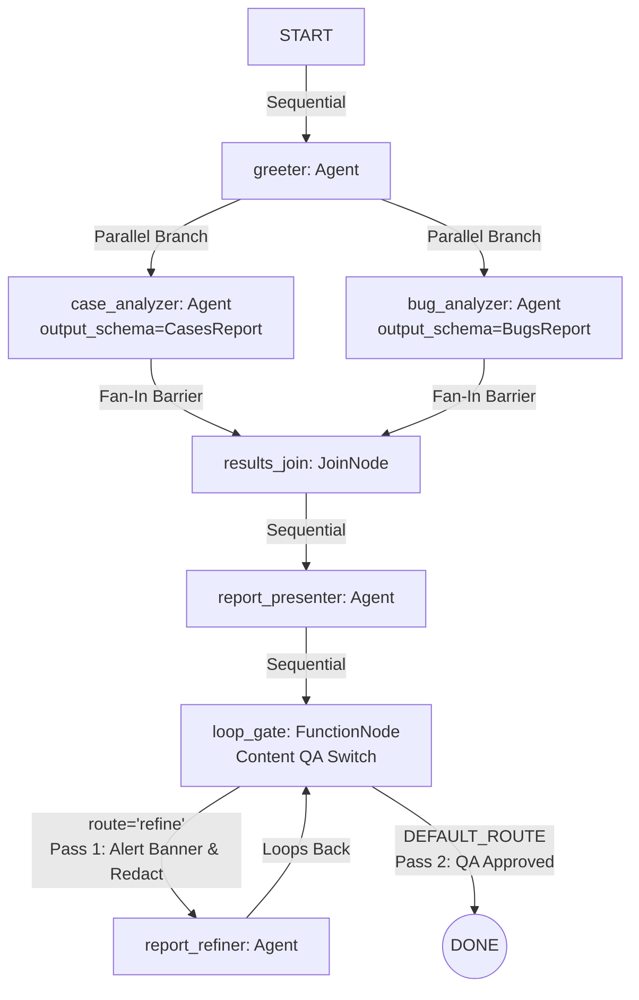

# Google ADK 2.0 - Smart Parser

A full-featured multi-agent support case and internal bug analysis pipeline showcasing **Google Agent Development Kit (ADK) 2.0**.

This project serves as a clear, interactive reference demo for:
1. **Smart Parsing (Pydantic Structured Output)**: Extracting typed schemas directly from chaotic, multi-channel enterprise logs without fragile regex or boilerplate `FunctionNode` API wrappers.
2. **Sequential Execution**: Chaining agents and nodes in a linear progression.
3. **Parallel Execution & Fan-In Barriers**: Running independent analyzers (`case_analyzer` and `bug_analyzer`) concurrently and synchronizing their outputs at a `JoinNode` barrier.
4. **Content-Aware Loop Execution**: A self-auditing QA loop (`loop_gate` $\leftrightarrow$ `report_refiner`) guarded by conditional edge routing (`route="refine"` vs `DEFAULT_ROUTE`) that inspects draft reports for missing executive alerts and redacts confidential internal tracking URLs (`internal.pr.tracker/...`).

---

## 🏛 Architecture & Workflow Graph



### Node Breakdown
* **`greeter` (`Agent`)**: Introduces the Case & Bug Analyzer to the user and announces parallel analysis.
* **`case_analyzer` (`Agent`)**: Uses native **Smart Parsing** (`output_schema=CasesReport`) to parse chaotic email copy-paste, Slack transcripts, and PagerDuty incident alerts (`cases.py`) into typed `CaseDetails` Pydantic instances.
* **`bug_analyzer` (`Agent`)**: Uses native **Smart Parsing** (`output_schema=BugsReport`) to extract internal engineering bugtracker dumps (`bugs.py`) into typed `BugDetails` instances.
* **`results_join` (`JoinNode`)**: Synchronization barrier that waits for both parallel branches to complete and merges their structured JSON outputs.
* **`report_presenter` (`Agent`)**: Takes the merged structured data and generates initial Markdown tables for Support Cases and Internal Bugs.
* **`loop_gate` (`FunctionNode`)**: A 100% deterministic Python routing gate that inspects the draft report for:
  1. Leaked confidential internal URLs (`internal.pr.tracker/...`).
  2. Missing executive priority alert banners (`EXECUTIVE ESCALATION ALERT`).
  * If either condition is violated, it emits `ctx.route = "refine"` and passes the draft report into the loop. Once clean, it emits `DEFAULT_ROUTE`.
* **`report_refiner` (`Agent`)**: Invoked on the `"refine"` route to prepend a prominent **`### 🚨 EXECUTIVE ESCALATION ALERT 🚨`** banner highlighting P1 escalated cases and redact all sensitive internal PR/bugtracker URLs.

---

## ⚡ Key Highlights of ADK 2.0 Displayed

### 1. No More Boilerplate for Smart Parsing
In older frameworks, getting structured JSON from an LLM required wrapping `genai.Client().models.generate_content(...)` inside custom Python functions. In ADK 2.0, you simply pass your Pydantic schema to `output_schema=` on any `Agent`:
```python
case_analyzer = Agent(
    name="case_analyzer",
    model="gemini-flash-latest",
    instruction="Analyze these unstructured support cases...",
    output_schema=CasesReport,
    mode="single_turn",
)
```

### 2. Why Python Logic (`FunctionNode`) Rules Loop Gates
ADK 2.0 enforces that any cycle in a `Workflow` graph must contain at least one conditional routed edge (`Edge(..., route="...")`) to prevent infinite loops.
Using a Python `FunctionNode` (`loop_gate`) as the traffic controller instead of an LLM agent provides:
* **Sub-millisecond speed & $0 token cost** for string inspection (`"internal.pr.tracker/" in text`).
* **Mathematical determinism** with safety counters (`attempts < 3`).
* **True Hybrid AI Design**: Let LLMs handle fuzzy synthesis and redaction; let Python handle exact conditional branching.

---

## 🛠 Installation & Setup

1. **Clone the repository**:
   ```bash
   git clone https://github.com/miguegutGoogle/adk-smart-parser.git
   cd adk-smart-parser
   ```

2. **Set up a Python virtual environment**:
   ```bash
   python3 -m venv venv
   source venv/bin/activate
   ```

3. **Install dependencies**:
   ```bash
   pip install -r requirements.txt
   ```

4. **Set your Gemini API Key**:
   ```bash
   export GEMINI_API_KEY="your-gemini-api-key-here"
   ```

---

## 🚀 Running the Demo (ADK Web Studio UI)

Launch the ADK visual dev server:
```bash
adk web --port 8000
```
1. Open `http://localhost:8000` in your web browser.
2. You will see the **interactive visual graph** showing all nodes and edges.
3. Start a conversation by typing `"Start analysis"` in the chat box.
4. Watch the live node execution trace:
   - **`greeter`**: Welcomes the user.
   - **`case_analyzer` & `bug_analyzer` (Parallel)**: Parses chaotic support & bug logs into Pydantic models simultaneously.
   - **`results_join`**: Fan-in barrier synchronizes both branches.
   - **`report_presenter`**: Outputs initial draft table (contains `internal.pr.tracker/48392` and lacks alert banner).
   - **`loop_gate` (Iter 1)**: Detects internal tracking URL & missing alert banner $\rightarrow$ triggers `route="refine"`.
   - **`report_refiner`**: Adds the `🚨 EXECUTIVE ESCALATION ALERT 🚨` banner and strips `internal.pr.tracker/48392`.
   - **`loop_gate` (Iter 2)**: Verifies no internal links + alert banner present $\rightarrow$ emits `DEFAULT_ROUTE` $\rightarrow$ Complete!
