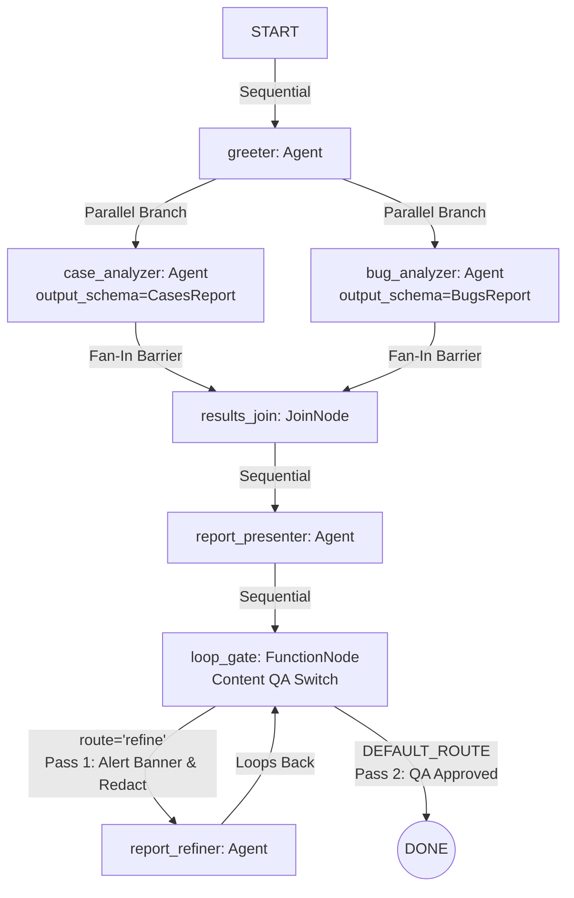

# Google ADK 2.0 - Smart Parser

A full-featured multi-agent support case and internal bug analysis pipeline showcasing **Google Agent Development Kit (ADK) 2.0**.

This project serves as a clear, interactive reference demo for:
1. **Smart Parsing (Pydantic Structured Output)**: Extracting typed schemas directly from chaotic, multi-channel enterprise logs without fragile regex or boilerplate `FunctionNode` API wrappers.
2. **Sequential Execution**: Chaining agents and nodes in a linear progression.
3. **Parallel Execution & Fan-In Barriers**: Running independent analyzers (`case_analyzer` and `bug_analyzer`) concurrently and synchronizing their outputs at a `JoinNode` barrier.
4. **Content-Aware Loop Execution**: A self-auditing QA loop (`loop_gate` $\leftrightarrow$ `report_refiner`) guarded by conditional edge routing (`route="refine"` vs `DEFAULT_ROUTE`) that inspects draft reports for missing executive alerts and redacts confidential internal tracking URLs (`internal.pr.tracker/...`).

---

## ⚡ The ADK 2.0 Paradigm Shift: Graph Orchestration vs. Prompt Orchestration

In **ADK 1.0** (such as projects like [`miguegutGoogle/poet`](https://github.com/miguegutGoogle/poet/blob/main/poet/prompt.py)), multi-agent control flow was entirely **prompt-driven**. You had to cajole the LLM in plain text: *"When you finish writing the stanza, invoke the next agent tool"*. This left routing vulnerable to probabilistic drift, missed handoffs, and infinite loops.

In **ADK 2.0**, **control flow belongs to the graph (`Workflow`), NOT the LLM prompt**:

| Capability | ADK 1.0 (Prompt-Driven Routing) | ADK 2.0 (Deterministic Workflow Graph) |
| :--- | :--- | :--- |
| **Agent Handoffs** | Rely on the LLM generating tool calls to pass control to the next agent. | **100% Deterministic Edges** (`A -> B`). Zero risk of skipped steps. |
| **Parallel Execution** | Hard to orchestrate without writing custom threading/async wrapper scripts. | **Native Fork & Fan-In** (`A -> (B, C) -> JoinNode`). Runs concurrently out-of-the-box. |
| **Conditional Loops** | LLMs can loop infinitely or forget to exit without complex text instructions. | **Deterministic Python Gates** (`FunctionNode` with safety counters `attempts < 3`). |
| **Prompt Complexity** | Prompts bloated with routing rules, handoff syntax, and state reminders. | Prompts focused **100% on domain intelligence** (analyzing cases or redacting URLs). |

---

## 🏛 Architecture & Workflow Graph



### Node Breakdown
* **`greeter` (`Agent`)**: Introduces the Case & Bug Analyzer to the user and announces parallel analysis.
* **`case_analyzer` (`Agent`)**: Uses native **Smart Parsing** (`output_schema=CasesReport`) to parse chaotic email copy-paste, Slack transcripts, and PagerDuty incident alerts (`cases.py`) into typed `CaseDetails` Pydantic instances.
* **`bug_analyzer` (`Agent`)**: Uses native **Smart Parsing** (`output_schema=BugsReport`) to extract internal engineering bugtracker dumps (`bugs.py`) into typed `BugDetails` instances.
* **`results_join` (`JoinNode`)**: Synchronization barrier that waits for both parallel branches to complete and merges their structured JSON outputs.
* **`report_presenter` (`Agent`)**: Takes the merged structured data and generates initial Markdown tables for Support Cases and Internal Bugs.
* **`loop_gate` (`FunctionNode`)**: A 100% deterministic Python routing gate that inspects the draft report for:
  1. Leaked confidential internal URLs (`internal.pr.tracker/...`).
  2. Missing executive priority alert banners (`EXECUTIVE ESCALATION ALERT`).
  * If either condition is violated, it emits `ctx.route = "refine"` and passes the draft report into the loop. Once clean, it emits `DEFAULT_ROUTE`.
* **`report_refiner` (`Agent`)**: Invoked on the `"refine"` route to prepend a prominent **`### 🚨 EXECUTIVE ESCALATION ALERT 🚨`** banner highlighting P1 escalated cases and redact all sensitive internal PR/bugtracker URLs.

---

## ⚡ Key Highlights of ADK 2.0 Displayed

### 1. LLM Smart Parsing for Chaotic Data vs. Regex
We love parsing—and choosing the right parsing paradigm for the shape of your data is critical.

Look at the synthetic enterprise logs in [`data/cases.py`](file:///Users/miguegut/Desktop/ADK2.0/case_analyzer/data/cases.py) *(note: 100% synthetic data generated for this demo)*:
```text
--- EMAIL FORWARD ---
Subject: Fwd: URGENT: Cloud SQL CPU hitting 100% constantly!! (#ticket-10241)
...
=== SLACK TRANSCRIPT (CHANNEL #support-triage) ===
[10:00 CDT] miguel_g: hey @here got a weird one - ref: 10242...
[11:32 CDT] sarah_mgr: escalating ticket 10242 to Tier 3 support bridge immediately!!
...
[[PAGERDUTY INCIDENT ALERT - Case-10243]]
**API Gateway intermittent 502 Bad Gateway errors**
```
* **Why Regex / Imperative Code Fails Here**: Across an email copy-paste, a Slack transcript, and a PagerDuty alert, ticket IDs are scattered (`#ticket-10241` vs `ref: 10242` vs `Case-10243`), timestamps follow different formats, and critical fields like `escalated` are implicit (*"escalating ticket 10242 to Tier 3 support bridge immediately!!"*). Writing fragile regex rules to parse all three into a clean table would break constantly.
* **Why Native ADK 2.0 Smart Parsing Succeeds**: In ADK 2.0, you eliminate boilerplate function wrappers around LLM calls. Simply pass your typed Pydantic model (`CasesReport`) to `output_schema=` on `Agent`:
```python
case_analyzer = Agent(
    name="case_analyzer",
    model="gemini-flash-latest",
    instruction="Analyze these unstructured support cases...",
    output_schema=CasesReport,
    mode="single_turn",
)
```

### 2. Python Exact Parsing (`FunctionNode`) for Conditional Loop Gates
While LLMs excel at chaotic natural language parsing, **we shouldn't waste tokens, latency, or probabilistic model variation on exact string checks**.

When inspecting whether a draft report contains a leaked internal URL (`internal.pr.tracker/`), a Python substring check (`"internal.pr.tracker/" in text`) inside a `FunctionNode` (`loop_gate`) provides:
* **Sub-millisecond latency & $0 token cost** for exact string inspection.
* **Mathematical determinism & safety caps** (`attempts < 3`).
* **Graph Cycle Compliance**: ADK 2.0 enforces that any cycle in a `Workflow` graph must contain at least one conditional routed edge (`Edge(..., route="...")`) to prevent infinite loops. Let LLM agents handle fuzzy synthesis and redaction; let Python handle exact conditional routing.

---

## 🛠 Installation & Setup

1. **Clone the repository**:
   ```bash
   git clone https://github.com/miguegutGoogle/adk-smart-parser.git
   cd adk-smart-parser
   ```

2. **Set up a Python virtual environment**:
   ```bash
   python3 -m venv venv
   source venv/bin/activate
   ```

3. **Install dependencies**:
   ```bash
   pip install -r requirements.txt
   ```

4. **Set your Gemini API Key**:
   ```bash
   export GEMINI_API_KEY="your-gemini-api-key-here"
   ```

## 📁 Project Directory Layout

```
adk-smart-parser/
├── README.md
├── requirements.txt
└── smart_parser/
    ├── __init__.py
    ├── agent.py            # ADK 2.0 Workflow Graph & Smart Parsing Agents
    └── data/
        ├── __init__.py
        ├── cases.py        # Messy multi-channel support logs (synthetic)
        └── bugs.py         # Bugtracker dump with internal tracker URLs (synthetic)
```

---

## 🚀 Running the Demo (ADK Web Studio UI)

Launch the ADK visual dev server pointing to the `smart_parser` package:
```bash
adk web --port 8000 smart_parser
```
1. Open `http://localhost:8000` in your web browser.
2. You will see the **interactive visual graph** showing all nodes and edges.
3. Start a conversation by typing `"Start analysis"` in the chat box.
4. Watch the live node execution trace:
   - **`greeter`**: Welcomes the user.
   - **`case_analyzer` & `bug_analyzer` (Parallel)**: Parses chaotic support & bug logs into Pydantic models simultaneously.
   - **`results_join`**: Fan-in barrier synchronizes both branches.
   - **`report_presenter`**: Outputs initial draft table (contains `internal.pr.tracker/48392` and lacks alert banner).
   - **`loop_gate` (Iter 1)**: Detects internal tracking URL & missing alert banner $\rightarrow$ triggers `route="refine"`.
   - **`report_refiner`**: Adds the `🚨 EXECUTIVE ESCALATION ALERT 🚨` banner and strips `internal.pr.tracker/48392`.
   - **`loop_gate` (Iter 2)**: Verifies no internal links + alert banner present $\rightarrow$ emits `DEFAULT_ROUTE` $\rightarrow$ Complete!
